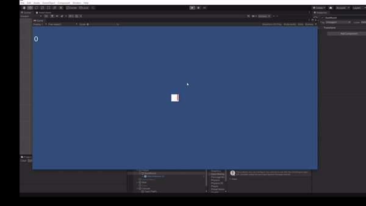

# Modul-2

## Guns 

### 1. prepare gun game object
1. create empty game object di dalam game object Player dengan nama "Gun"
2. add component sprite renderer
3. drag and drop sprite 1px.png ke row dengan label Sprite
4. ganti warna sprite nya (untuk membedakan dengan gameobject lain)
5. scale gameobject agar berbentuk persegi panjang
6. create empty game object di dalam gameobject "Gun" dan geser posisinya di depan object guns (game object ini nantinya akan digunakan untuk posisi dimana peluru akan spawn)

### 2. prepare bullet game object
1. create empty gameobject dengan nama "Bullet"
2. tambahkan sprite seperti pada langkah sebelumnya
3. ganti warna sprite nya juga
4. lalu scale sesuai keinginan
5. kemudian add component rigidbody2d dan ubah gravity scale menjadi 0
6. add component collider2d dan sesuaikan dengan object nya
7. di Assets create folder bernama prefabs lalu drag and drop gameobject "Guns" ke dalam foldernya 
